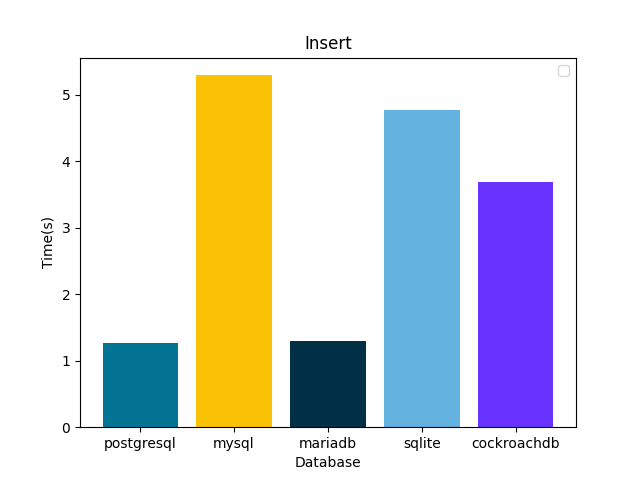

# Comparing Database performance with Django ORM

- Postgresql 
- MySQL
- MariaDB
- SQLite

Comparing database operation performance using django ORM.

PostgreSQL vs MySQL vs MariaDB vs SQLite

## Insert performance comparison 
Tested 1000 row insert in all databases and calculated time is taken.

## Bulk Insert performance comparison 
Tested 1000 row bulk insert in all databases and calculated time is taken.

## Bulk Delete performance comparison 
Tested 1000 row delete in all databases and calculated time is taken.

## Bulk Delete performance comparison 
Tested 1000 row bulk delete in all databases and calculated time is taken.

## Update performance comparison 
Tested 1000 row update in all databases and calculated time is taken.

## Bulk update performance comparison 
Tested 1000 row bulk update in all databases and calculated time is taken.

