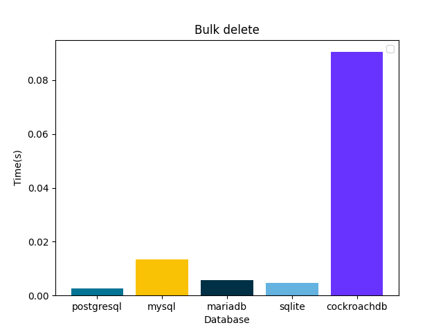
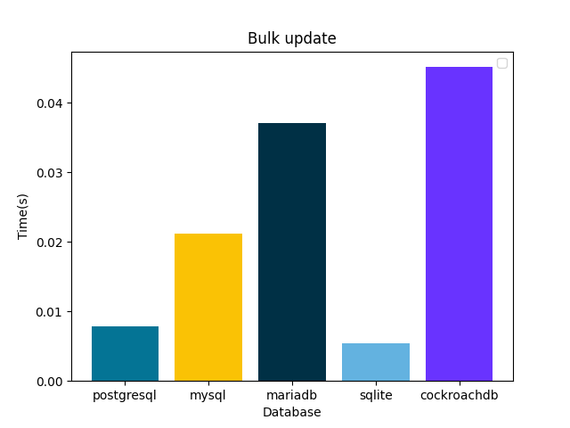

# Django ORM Database Performance Benchmark

This project benchmarks and compares the performance of popular SQL databases using the Django ORM. It provides detailed metrics for common database operations across different database backends.

**Databases tested:**
- PostgreSQL
- MySQL
- MariaDB
- SQLite
- CockroachDB

## Overview

Measure and compare the speed of database operations (insert, bulk insert, delete, bulk delete, update, bulk update, select, and indexed select) using Django ORM on AWS T2 micro instances. Results include execution time and performance graphs for each operation and database.

## Benchmark Results

### Insert Performance Comparison
Tested 1000 row inserts in all databases and measured execution time.


### Bulk Insert Performance Comparison
Tested 1000 row bulk inserts in all databases and measured execution time.


### Delete Performance Comparison
Tested 1000 row deletes in all databases and measured execution time.


### Bulk Delete Performance Comparison
Tested 1000 row bulk deletes in all databases and measured execution time.



### Update Performance Comparison
Tested 1000 row updates in all databases and measured execution time.


### Bulk Update Performance Comparison
Tested 1000 row bulk updates in all databases and measured execution time.



### Select Performance Comparison (Non-Indexed Column)
Tested 1000 select queries on non-indexed columns in all databases and measured execution time.


### Select Performance Comparison (Indexed Column)
Tested 1000 select queries on indexed columns in all databases and measured execution time.


## How to Run the Benchmark

1. Install [Docker](https://docs.docker.com/engine/install/) and [Docker Compose](https://docs.docker.com/compose/install/).
2. Clone this repository:
   ```sh
   git clone https://github.com/yourusername/django-db-benchmark.git
   cd django-db-benchmark
   ```
3. Start the benchmark:
   ```sh
   ./start.sh
   ```
4. View the results in the `reports/graph` directory.

## Keywords

Django ORM, database benchmark, SQL performance, PostgreSQL, MySQL, MariaDB, SQLite, CockroachDB, database comparison, bulk insert, bulk update, bulk delete, select performance, indexed query, AWS T2 micro, Docker, Python, open source.

