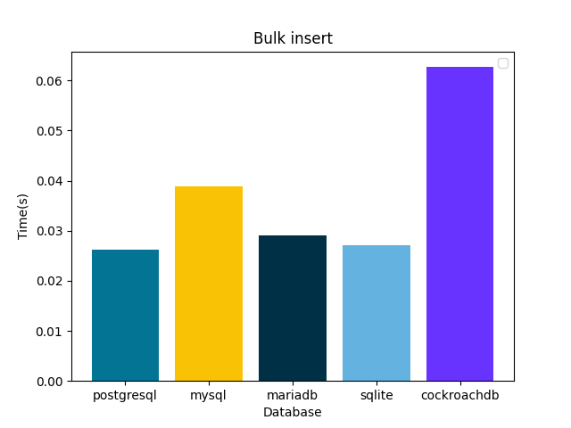
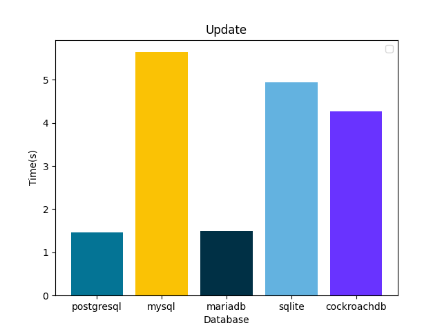

# django-db-benchmark
Database benchmark with Django ORM

- Postgresql 
- MySQL
- MariaDB
- SQLite

Compating databse operation perfomence using django ORM 

Postgreql vs MySQL vs MariaDB vs SQLite

## Insert performance comparison 
Smaller is better Here *PostgreSQL* wins

## Bulk Insert performance comparison 
Smaller is better Here *SQLite* wins

## Bulk Delete performance comparison 
Smaller is better Here *SQLite* wins

## Update performance comparison 
Smaller is better Here *SQLite* wins

## Bulk update performance comparison 
Smaller is better Here *SQLite* wins

